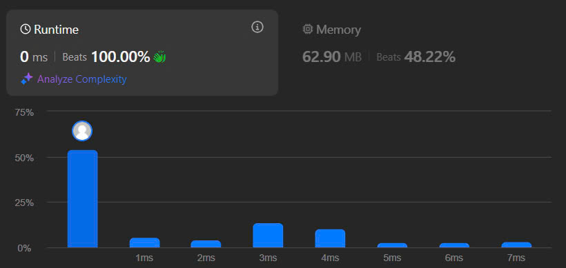

# 11. Container With Most Water
## Đề bài

Cho dãy số nguyên Hieght có độ dài n. Mỗi giá trị nằm trên mảng đại diện cho chiều cao, hãy tìm thể tích lớn nhất mà cặp Hieght[i] và Hieght[j] có thể chứa.

Ví dụ 1:

Đầu vào: height = [1,8,6,2,5,4,8,3,7]

Đầu ra: 49

Ví dụ 2:

Đầu vào: height = [1,1]

Đầu ra: 1

Giới hạn:

- n == height.length

- 2 <= n <= 10^3

- 0 <= height[i]<= 10^4

## Phân tích dữ liệu

Bài toán cho chúng ta 1 dãy số có độ dài n gồm các giá trị đại diện cho chiều cao và ta phải tìm thể tích lớn nhất có thể xuất hiện.

V = min(a) × b

- V thể tích có được.
- a là chiều dài (khoảng cách i - j)
- b là chiều cao (lấy giá trị nhỏ hơn ở Height[i] hoặc Height[j]).

Với công thức này thì giá trị và vị trí bị ràng buộc tuyệt đối, bạn phải giữ nguyên cấu trúc mảng. Bởi nếu sort mảng thì gián tiếp làm thay đổi a.

Mà b lại bất định không quy luật, ta chỉ có thể dựa vào a để chọn cách tối ưu, bằng cách đi xuất phát ở vị trí dài nhất sau đó di chuyển dần vào nhau cho đến khi giao nhau, ta sẽ loại bỏ được n cặp [i, j] nhỏ nhất và chỉ lấy những cặp [i, j] cho V cao nhất. Bởi V = min(a) × b nếu b = b/2 thì V cũng = V/2, bắt đầu từ lúc này V chắc chắn không được ghi nhận nên phải loại bỏ để đỡ tốn tài nguyên.

## Giải thích thuật toán

Bài toán này nói giản là tìm cặp [i, j] sao cho Height[i]*(j-i) hoặc Height[j]*(j-i) là lớn nhất tùy theo giá trị tại i hay j bé hơn.

Cách đơn giản nhất là dùng 2 vòng lặp để duyệt 2 lần độ phức tạp là O(n^2). Tuy nhiên, chúng ta có thể giảm độ phức tạp về O(n) nếu dùng kỹ thuật 2 con trỏ di chuyển 2 đầu di chuyển dần về nhau.

Bước 1: Tạo các biến cần thiết là 2 đầu mút trái, phải và biến để lưu kết quả tốt nhất.

Bước 2: Tạo vòng lặp while khi vị trí đầu bên trái bé hơn đầu bên phải.

*Trong while*

Bước 3: Xét điều kiện trái và phải bên nào nhỏ hơn.

Bước 4: Nếu phải nhỏ hơn thì lại xét thể tích hiện tại đang lớn hơn kết quả đang lưu hay không? nếu có thì lưu kết quả này lại rồi tăng l còn nếu không thì chỉ tăng l mà thôi.

Bước 5: Nếu ngược lại bên trái lớn hơn bên phải thì làm tương tự với bước 4 nhưng với vị trí bên trái.

Bước 7: Trả kết quả.

## Kết quả leetcode

## Thảo luận

Đây là bài toán cơ bản để luyện kỹ thuật 2 con trỏ, kỹ thuật này dùng để hạ bậc độ phức tạp của cách search 2 vòng lặp O(n^2) về O(n). Bạn có thể dùng kỹ thuật này để giải quyết bài toán 3Sum.

## Tham khảo

[Source code C++](./Container-With-Most-Water.cpp)

[15. 3Sum](../../Sort/15.%203Sum/Readme.md)

-Chúc các bạn thành công-
