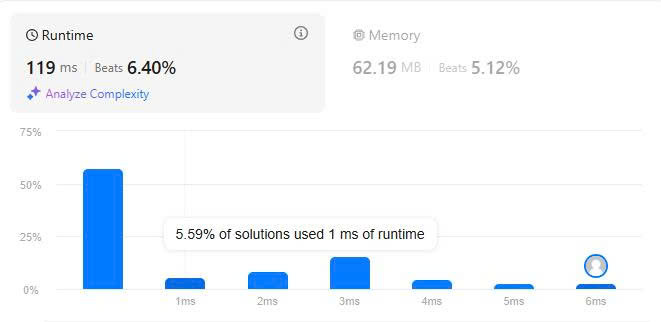

# 46. Permutations
## Đề bài
Cho trước một dãy số nguyên và bạn hãy trả về toàn bộ các hoán vị có thể phát sinh.

*Ví dụ 1:*

Đầu vào: nums = [1,2,3]

Đầu ra: [[1,2,3],[1,3,2],[2,1,3],[2,3,1],[3,1,2],[3,2,1]]

**Ví dụ 2:**

Đầu vào: nums = [0,1]

Đầu ra: [[0,1],[1,0]]

*Ví dụ 3:*

Đầu vào: nums = [0,0,0]

Đầu ra: [[0,0,0]]

*Giới hạn:*

- 1 <= nums.length <= 6
- -10 <= nums[i] <= 10
- Dãy số không trùng lặp

## Giải thích thuật toán

Đây là một bài nằm trong chuyên mục đệ quy (BackTracking) nên các giải cũng như tên ta sẽ dùng đệ quy để sinh ra toàn bộ tổ hợp có thể phát sinh.

Đệ quy là cách mà tự hàm gọi chính nó cho đến khi tìm thấy điều kiện kết thúc vòng lặp gọi hàm và trả về kết quả.

Tuy đệ quy là một các ngắn gọn và dễ thực hiện nhưng nhược điểm của đệ quy lại quá rõ ràng đó là độ phức tạp của thuật toán và chi phí lồng hàm gọi hàm là quá lớn. Nếu bạn có cách tốt hơn để xử lý thì tôi đề xuất nên dùng cách đó chứ không nên dùng đệ quy.

Tất nhiên, đây cũng là một bài phát sinh các hoán vị thì thuật toán của bài 35. Next Permutations hoàn toàn có thể dùng được nhưng đây là bài đệ quy nên tôi sẽ dùng thuật toán đệ quy ở bài này sau đó đến bài 47. Permutations II tôi sẽ áp dụng thuật toán phát sinh hoán vị theo thứ tự từ diển để các bạn có thể so sánh tốc độ thực thi và chi phí bộ nhớ của 2 phương pháp này.

Các bước cụ thể như sau:

Bước 1:  Tạo 1 hàm con dùng để đệ quy.

*Trong hàm con*

Bước 2: Xác định điều hiện dừng if n == 0 và nhận kết quả ở đây, tôi đang dùng đệ quy quay lui nên n == 0 là điểm dừng vì sau mỗi vòng đệ quy thì n sẽ bị giảm.

Bước 3: Tạo vòng for i chạy đến khi > n (đây là điều kiện rẽ nhánh để tạo các hoán vị đầu mút i di chuyển dần về n)

*Trong for i*

Bước 4: Swap nums[i] với num[n] rồi để hàm tự call chính nó với điều kiện n - 1.

Bước 5: Hoàn tác thao tác để khi rút khỏi tầng dãy nums được hoàn trả như cũ và nhánh tiếp theo sẽ dùng lại.

Bước 6: Sau khi kết thúc vòng for ta lại tiếp tục để hàm tự gọi với n - 1 để rẽ sang nhánh khác

*Trong hàm chính*

Bước 7: Tạo các biến cần thiết

Bước 8: Gọi hàm

Bước 9: Trả kết quả

## Kết quả LeetCode

## Thảo luận

Thuật toán này có độ phức tạp O(n*n!) phát sinh đầy đủ tổ hợp nhưng chi phí và thời gian chạy quá lớn.

## Tham khảo

[Source Code C++](./Permutations.cpp)

[Bài 47. Permutations II](../47.%20Permutations%20II/PermutationsII-algorithms.md)

-Chúc các bạn thành công-