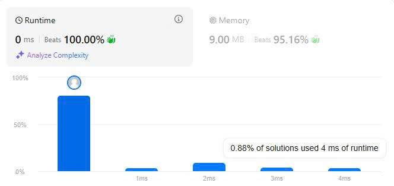

# 31. Longest Substring Without Repeating Characters
## Đề bài
Cho một chuỗi ký tự số từ 2-9, trả về toàn bộ những tổ hợp ký tự có thể phát sinh dựa trên nút bấm của bàn phím điện thoại kiểu cũ.

*Ví dụ 1:*

Đầu vào: digits = "23"

Đầu ra: ["ad","ae","af","bd","be","bf","cd","ce","cf"]

*Ví dụ 2:*

Đầu vào: digits = "2"

Đầu ra: ["a","b","c"]

*Giới hạn:*

- 1 <= digits.length <= 4

- digits[i] nằm trong khoảng ['2', '9'].

## Giải thích thuật toán

Đây là bài toán sinh tổ hợp theo tầng với số tầng là độ dài chuỗi digits, hoặc còn gọi là bài toán nhân số hạng.

với "23"

Tầng 1: [a] [b] [c] (sau đó nhân từng số hạng ở tầng 1 với từng số hạng ở tầng 2 để cho ra kết quả của tầng 2

Tầng 2: [ad = a*d] [ae = a*e] [af = a*f] rồi tiếp tục với b (nó như bài toán fibonance kết quả ở vòng này là từ vòng trước nhân với vòng hiện tại)

Cho nên chúng ta có thể dùng kỹ thuật đệ quy để giải quyết bài toán. Tuy nhiên, đệ quy lại có nhược điểm cực kỳ chết người đó là chi phí bộ nhớ cao do phải cấp phát cho nhiều hàm liên tục, việc gọi hàm liên tục cũng phát sinh thêm chi phí thời gian mặc dù độ phức tạp như nhau.

Do đó tôi quyết định dùng bảng băm kết hợp 2 vòng lặp for để tạo độ sâu. Tiết kiệm chi phí cấp phát và thực thi tối đa.

Bước 1: Tạo bảng băm tĩnh kiểu dữ liệu string (Bởi vì đây là bài toán nhỏ nếu dùng unordered_set hoặc unordered_map thì chi phí lưu, hash key, cấp phát, truy cập sẽ tăng chi phí bộ nhớ và thao tác nên tôi dùng mảng string với key là vị trí trong mang chỉ cấp phát 1 lần không thay đổi chi phí tìm kiếm O(1)).

Bước 2: Tạo các biến cần thiết

Bước 3: Duyệt từng vị trí của Digits để lấy key

Bước 4: Cast sang int để truy cập mảng string.

Bước 5: Thêm tầng đầu tiên vào vector kết quả.

Bước 6: Duyệt vector kết quả và nhân với các giá trị kế tiếp

Bước 7: Trả kết quả.

## Kết quả LeetCode

## Thảo luận

Đệ quy là một kỹ thuật dễ sử dụng tuy nhiên nhược điểm của nó quá lớn so với kết quả thu về được.

Nếu bạn có cách khác để giải bài toán thì tôi đề xuất dùng nó thay vì dùng đệ quy. Với phương pháp giải bằng bảng băm kết hợp vòng lặp có cùng độ phức tạp so với đệ quy nhưng tốc độ và bộ nhớ được tối ưu hơn nhiều.

Bài toán này không còn thể tối ưu thêm độ phức tạp, bởi đề yêu cầu cho ra hết toàn bộ tổ hợp.

## Tham khảo

[Source code C++](./Letter-Combinations-of-a-Phone-Number.cpp)

-Chúc các bạn thành công-
