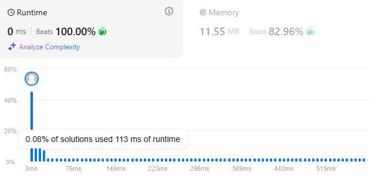

# 31. Longest Substring Without Repeating Characters
## Đề bài
Cho một mảng chuỗi ký tự s, tìm chuỗi con có độ dài lớn nhất mà không xuất hiện trùng lặp.

*Ví dụ 1:*

Đầu vào:  strs = s = "abcabcbb"

Đầu ra: 3

*Giải thích*

Câu trả lời là "abc", có độ dài là 3. Các biến thể khác chỉ là hoán vị và cũng là câu trả lời đúng.

*Ví dụ 2:*

Đầu vào: s = "bbbbb"

Đầu ra: 1

*Ví dụ 3:*

Đầu vào: s = "pwwkew"

Đầu ra: 3

*Giới hạn:*

- 0 <= s.length <= 5*10^4

- s là chữ cái tiếng Anh bao gồm ký tự, số, ký hiệu và khoảng trống.

## Giải thích thuật toán

Đây là bài toán áp dụng kỹ thuật 2 con trỏ để tạo cửa sổ trượt kết hợp với bảng băm để ghi nhớ tín hiệu xuất hiện của các ký tự trong chuỗi.

Cửa sổ trượt nó như một cửa kéo chia dãy số hoặc dãy ký tự thành 2 phần:

1. Hiển thị - nằm trong khoảng giữa 2 con trỏ.

2. Vùng không hiển thị - nằm ngoài vị trí giữa 2 con trỏ

Mô tả cửa sổ hiện thị bằng ví dụ như sau

(a, b, c, a, b, c, b, b)

([a], *, *, *, *, *, *, *)

([a, b], *, *, *, *, *, *)

([a, b, c], *, *, *, *, *)

([a, b, c, a], *, *, *, *)

(*, [b, c, a], *, *, *, *)

Bởi vì cách di chuyển như vậy nên ta gọi nó là cửa sổ trượt, và kết hợp với bảng băm để ghi nhận những giá trị xuất hiện trong cửa sổ.

Bạn có thể dùng unordered_set để làm bảng băm tuy nhiên hiệu quả xử lý lại kém hơn bởi vì khi nhận key set lại dùng hàm của chính nó để băm key và lưu giá trị lại, chưa nói đến việc sau khi nhận diện được ký tự bị trùng bạn vẫn phải trượt biên trái của cửa sổ dần về phải dẫn đến kéo dài độ phức tạp do chi phí phát sinh từ băm key liên tục tra cứu và xóa của unordered_set.

Để giải quyết vấn đề này ta có thể dùng Vector để làm bảng băm, với cách băm key là chuyển ký tự trong chuỗi thành unsigned char chỉ có giá trị từ 0 -> 255 nhưng vẫn chứa đầy đủ các dạng ký tự tiếng anh.

Còn một cách khác đó là dung mảng số nguyên có độ dài 256 để làm bảng băm. Tuy nhiên, bạn phải dùng 1 vòng lặp for để set-up giá trị ban dầu nên rườm rà hơn.

Bước 1: Tạo bảng băm vector HashT

Bước 2: Tạo các biến lưu độ dài chuỗi và con trỏ trái.

Bước 3: Tạo khóa của bảng băm

Bước 4: Tạo vòng lặp for j với j là con trỏ bên phải.

*Trong lặp for*

Bước 5: Băm khóa bằng cách ép kiểu string của s[j] về unsigned char.

Bước 6: Đối chiếu với HashT để xem ký tự này đã xuất hiện chưa bởi biên của cửa sổ là [i, j] nếu ký tự hiện tại đã xuất hiện trong [i, s[j]] nên chỉ cần so sánh vị trí hiện tại với i nếu >= i thì đã xuất hiện.

Bước 7: Nhảy cóc i đến vị trí sau vị trí đã gặp ký tự này lần trước (Bởi vì chuỗi abcab bắt đầu từ a đến khi gặp a lần nữa và nhảy lên vị trí hiện tại thì bạn sẽ mất chuỗi bca và cab)

Bước 8: So sánh độ dài chuỗi cũ với cuỗi mới và lấy cái có độ dài lớn hơn.

Bước 9: Ghi nhận lại lần xuất hiện này vào bảng HashT

Bước 10: Trả kết quả.

## Kết quả LeetCode

## Thảo luận

Kỹ thuật cửa sổ trượt là một dạng kỹ thuật nâng cao của kỹ thuật sử dụng 2 con trỏ, giúp chúng ta chọn lọc thông tin tốt hơn khi xử lý dữ liệu với độ phức tạp O(n) thay vì O(n^2) như 2 con trỏ thông thường.

Tuy nhiên, mỗi dạng dữ liệu có 1 cách xử lý khác nhau không nên quá phụ thuộc vào kỹ thuật này.

## Tham khảo

[Source code C++](./Longest-Substring-Without-Repeating-Characters.cpp)

-Chúc các bạn thành công-