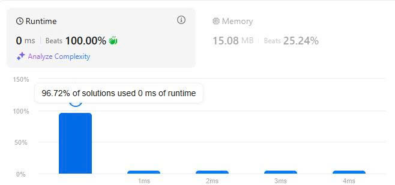

# 19. Remove Nth Node From End of List
## Đề bài
Cho trước node đầu 1 danh sách, hãy loại bỏ node thứ n tính từ đầu cuối ra trước và trả lại kết quả là node đầu tiên.

*Ví dụ 1:*

Đầu vào:  head = [1,2,3,4,5], n = 2

Đầu ra: [1,2,3,5]

*Ví dụ 2:*

Đầu vào: head = [1], n = 1

Đầu ra: []

*Ví dụ 3:*

Đầu vào: head = [1,2], n = 1

Đầu ra: [1]

*Giới hạn:*

- Độ dài danh sách trong khoảng [1, 30]

- 0 <= node.val <= 100

- 1 <= n <= 30

## Giải thích thuật toán

Đây là bài toán mô tả mối quan hệ giữa đường thẳng và điểm chia đoạn thẳng thành 2 đoạn thẳng con nằm trên cùng đoạn thẳng.

- Giả định L là chiều dài của danh sách đã cho và 2 đầu mút của đoạn thẳng là a nằm ở đầu và b nằm ở đuôi danh sách.

- n chia đoạn thẳng ab thành an và nb có L = an + nb, khi n di chuyển gần điểm a và đoạn nb tăng dần và n di chuyển về điểm b thì an tăng dần => an = L - nb;

- Áp dụng mối quan hệ nay với bất kỳ điểm n trên dãy ta có thể tìm điểm n bằng cách lấy L - nb.

Cụ thể thuật toán như sau:

Bước 1: Tạo 2 node đi song song nhau bắt đầu từ head

Bước 2: Node 1 di chuyển trước n bước với n với n là vị trí cần chọn.

Bước 3: Tạo vòng lặp while với điều kiện node tiếp theo của node 2 != nullptr.

Bước 4: Di chuyển Node 1 và 2 cho đến khi Node 1 đến code cuối cùng thì tại Node 2 đã đến vị trí cần tìm và chỉ cần bỏ qua nó.

Bước 5: Loại bỏ node kết tiếp

Bước 6: Trả kết quả.

Lúc này, Node 1 đã di chuyển trước n node tương đương quảng đường nb, để nó tiếp tục đi đến cuối ta sẽ tìm được an (an = L - nb)

## Kết quả LeetCode

## Thảo luận

Đây là một phương pháp toán học cơ bản có thể áp dụng để tối ưu độ phức tạp O(n + k) với n độ dài danh sách và k độ dài từ điểm đến cuối danh sách.

Phương pháp này tối ưu hơn cách truyền thống bạn duyệt danh sách để lấy độ dài rồi tiếp tục duyệt để loại bỏ vị trí chỉ định.

## Tham khảo

[Source code C++](./Remove-Nth-Node-From-End-of-List.cpp)

-Chúc các bạn thành công-