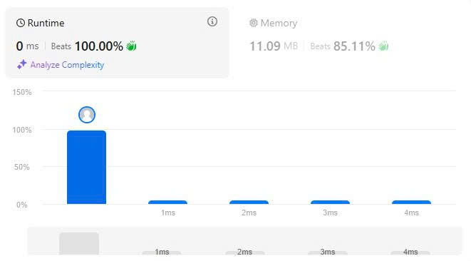

# 24. Swap Nodes in Pairs
## Đề bài

Cho một danh sách liên kết, hãy đảo vị trí của mỗi hai node liền kề và trả kết quả là node đầu tiên. Lưu ý không được động vào value của nodes.

*Ví dụ 1:*

Đầu vào:   head = [1,2,3,4]

Đầu ra: [2,1,4,3]

*Ví dụ 2:*

Đầu vào: head = []

Đầu ra: []

*Ví dụ 3:*

Đầu vào: head = [1]

Đầu ra: [1]

*Ví dụ 4:*

Đầu vào: head = [1,2,3]

Đầu ra: [2,1,3]

*Giới hạn:*

- Độ dài danh sách trong khoảng [1, 100]

- 0 <= node.val <= 100

## Giải thích thuật toán

Bài toán swap node này là bài toán hướng thao tác cấu trúc liên kết của danh sách liên kết nếu không cẩn thận bạn sẽ làm gãy liên kết và không tìm được node kế tiếp và bị fail.

Cái bạn cần swap ở đây là các node liên kết không phải giá trị mà node mang.

Nếu hình dung danh sách liên kết như 1 dòng thời gian gồm: Quá khứ -> Hiện tại -> Tương lai gần -> Tương lai xa.

Theo đề bài thì bạn cần swap giữa hiện tại và tương lai gần, tuy nhiên nếu bạn tráo đổi ngay Tương lai gần -> Hiện tại thì liên kết với tương lai xa bị đứt gãy dẫn đếp sụp đổ dòng thời gian (như theo Marvel nói)

Thể nên các bước để swap như sau:

- Hiện tại -> Tương lai xa.

- Tương lai gần -> Hiện tại.

- Quá khứ -> Tương lai gần

Và cuối cùng sinh chúc mừng bạn đã thành công đảo lộn dòng thời gian mà không phá hủy nó.

## Kết quả LeetCode

## Thảo luận

Bài này cho chúng ta thấy được việc thao tác với cấu trúc khác so với thao tác với giá trị. Cũng như cho thấy tầm quan trọng của việc giữ liên kết và điểm yếu của sự phân tán nếu bị mất liên kết.

## Tham khảo

[Source code C++](./Swap-Nodes-in-Pairs.cpp)

-Chúc các bạn thành công-