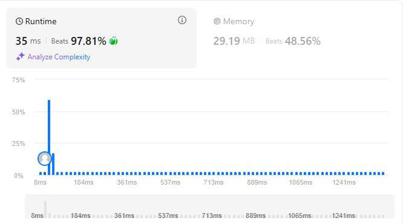

# 15. 3Sum

## Đề bài
Cho trước một dãy số nguyên và bạn hãy trả về toàn bộ các bộ ba theo cấu trúc [nums[i], num[j], num[k] sao cho i != j, i != k và j != k với [nums[i] + num[j] + num[k] = 0.
Chú ý, kết quả không được chứa những bộ ba lặp lại.

**Ví dụ 1:**

Đầu vào: nums = [-1,0,1,2,-1,-4]
Đầu ra: [[-1,-1,2],[-1,0,1]]
Giải thích: 
nums[0] + nums[1] + nums[2] = (-1) + 0 + 1 = 0.
nums[1] + nums[2] + nums[4] = 0 + 1 + (-1) = 0.
nums[0] + nums[3] + nums[4] = (-1) + 2 + (-1) = 0.
Các bộ ba cần tìm là [-1,0,1] và [-1,-1,2].
Chú ý chỉ lấy những bộ ba có tổng = 0.

**Ví dụ 2:**

Đầu vào: nums = [0,1,1]

Đầu ra: []

Giải thích: Bộ ba khả dĩ có tổng khác 0.

**Ví dụ 3:**

Đầu vào: nums = [0,0,0]

Đầu ra: [[0,0,0]]

Giải thích: Chỉ có một bộ ba số có tổng = 0.

**Giới hạn:**

- 3 <= nums.length <= 3000

- -10^5 <= nums[i] <= 10^5

## Phân tích dữ liệu

Đầu vào cho chúng ta một dãy số nguyên tuy nhiên lại không ràng buộc điều kiện là phải cố định giữa vị trí và giá trị trong dãy đây là một yếu tố đặc biệt quan trọng.

Giả sử:

- a = nums[i]
- b = nums[j]
- c = nums[k]

Và a + b + c = 0, với việc không ràng buộc vị trí và giá trị dẫn đến cánh cửa ta có thể sort mảng để mảng tăng tuyến tính tạo điều kiện toán học biến bài toán này về dạng toán 2Sum bằng cách cố định a và di chuyển b, c để tìm tổng a + b + c = 0.

Theo tính chất dãy số tuyến tính thì số phía sau luôn lớn hơn số phía trước và do b và c là những số có giá trị lớn hơn a dẫn đến nếu a >= 0 thì không cần phải xét b và c bởi lúc này a + b + c luôn lớn hơn 0.

và theo biểu thức toán học thì gọi need = target - a.

Từ đó ta được công thức need = b + c => b + c = target - a.

- Nếu a > target thì target - a luôn âm dẫn đến b + c luôn dương đây làm biểu thức vô nghiệm.
- Nếu b và c đổi giá trị và target cùng a không đổi giá trị thì biểu thức hiện tại vị chi phối bởi b và c ta phải cân bằng giữa b và c.

Need = b + c nếu b tăng thì need tăng ta phải giảm c để cân bằng lại từ đây áp vào tính chất của dãy số tuyến tính số phía sau luôn lớn hơn số phía trước nghĩa là số cuối cùng là lớn nhất và số đầu tiên là bé nhất ta có thể xét đồng thời 2 số này để nếu b + c > need thì nghĩa là tổng quá lớn ta phải giảm giá trị của c ngược lại thì tăng giá trị của b. Tăng giảm cân đối đến khi b + c = need thì đó là bộ ba a, b, c ta đang tìm.

## Giải thích thuật toán

Đây là bài toán tạo tổ hợp chập 3 của n với n là độ dài của dãy số.
Cách dễ nhất để giải bài toán này là sắp xếp dãy theo thứ tự tăng dần rồi tạo 3 vòng lặp lồng nhau để duyệt từng vì trí xem có tổng bằng 0 hay không rồi so sánh với các bộ ba đã tìm được và loại trùng lặp.
Tuy nhiên, cách làm này lại cho độ phức tạp O rất lớn dao động từ O(n^3) -> O(n^4). Cho nên để tối ưu độ phức tạp tôi quyết định dùng cách tạo 2 đầu mút với 1 vị trí cố định và duyệt 2 đầu mút di chuyển dần về nhau đến khi chúng chạm vào nhau.

Bước 1: Sắp xếp mảng đã cho theo thứ tự tăng dần.

Bước 2: Khai báo vector để trả kết quả.

Bước 3: Tạo vòng lặp for i di chuyển từ 0 đến độ dài dãy số - 2 (Lưu ý vấn đề độ dài của dãy nếu bạn không - 2 đơn vị thì sẽ bị lỗi vượt giới hạn chỉ số)

**Trong vòng lặp for**

Bước 4: Tạo đầu mút bên trái (l) với vị trí lớn hơn i 1 đơn vị.

Bước 5: Tạo đầu mút bên phải (r) với vị trí = độ dài mảng - 1 (Bởi máy tính bắt đầu đếm từ 0 nhưng con người lại bắt đầu đếm từ 1 và kết quả của hàm vector.size() luôn trả kết quả theo cách đếm của con người do đó bạn phải từ 1 đơn vị để lấy đúng độ dài của dãy)

Bước 6: Tạo điều kiện ngắt sớm vòng lặp for i. Nếu nums[i] > 0 thì ngắt vòng lặp (Bởi dãy số đã được sắp xếp theo thứ tự tăng dần và để tổng 3 số cho ra kết quả = 0 thì phải có số âm. i là vị trí cố định còn l và r là 2 đầu mút di chuyển, nếu i > 0 thì toàn bộ các số còn lại đều lớn hơn 0 và không thỏa điều kiện để tạo tổng = 0 nên có thể ngắt sớm vòng lặp).

Bước 7: Tạo điều kiện loại bỏ số trùng lặp tại vị trí i với i >= 1 và nums[i] == nums[i - 1] continue (Ta luôn phải lấy số đầu tiên và di chuyển i nên phải so sánh i hiện tại với i ở vị trí trước đó nếu cả 2 bằng nhau thì bỏ qua).

Bước 8: Tạo vòng lặp while với điều kiện l < r (l di chuyển từ trái sang phải luôn có thứ tự tăng dần, r di chuyển từ phải qua trái luôn có thứ tự giảm dần cho nên thời điểm giao nhau của l và r là khi cả 2 bằng nhau nếu dãy số chẵn và l > r nếu dãy số lẻ).

**Trong vòng lặp while**

Bước 9: Xét điều kiện để di chuyển l sang phải nếu tổng 3 số ở 3 vị trí i, l, r < 0. Vì đây là dãy số tăng nếu tổng 3 số < 0 thì so số ở bên trái đang bị nhỏ ta phải di chuyển sang phải 1 đơn vị để tìm số lớn hơn và cân bằng 3 số với nhau).

Bước 10: Xét điều kiện để di chuyển r sang trái nếu tổng 3 số ở 3 vị trí i, l, r > 0. Vì đây là dãy số tăng nếu tổng 3 số > 0 thì so số ở bên phải đang bị lớn ta phải di chuyển sang trái 1 đơn vị để tìm số nhỏ hơn và cân bằng 3 số với nhau).

Bước 11: Sau khi điều chỉnh số thì ta sẽ tìm được tổng 3 số = 0. Khởi tạo vector chứa 3 số đã tìm được rồi push_back chúng vào vector vừa tạo.

Bước 12: Push_back vector vừa tạo vào vector dùng để trả kết quả.

Bước 13: Di chuyển l sang phải 1 đơn vị và r sang trái 1 đơn vị (Nếu không di chuyển thì sẽ tạo vòng lặp vô hạn).

Bước 14: Sau khi đã di chuyển r sáng trái thì kiểm tra vị trí mới này có trùng với vị trí cũ hay không bằng vòng lặp while giảm r cho đến khi nums[r] != nums[r+1] (Bước này dùng để loại bỏ các tổ hợp có cùng phần tử nếu không thao tác sẽ bị lặp lại kết quả giống nhau).

Bước 15: Làm tương tự với l như r.

Bước 16: return vector trả kết quả.

## Kết quả LeetCode

## Thảo luận

Thuật toán này có độ phức tạp O(n^2) nhanh hơn các sử dụng 3 vòng lặp nhưng vẫn đảm bảo được kết quả cuối cùng.

-Chúc các bạn thành công-

