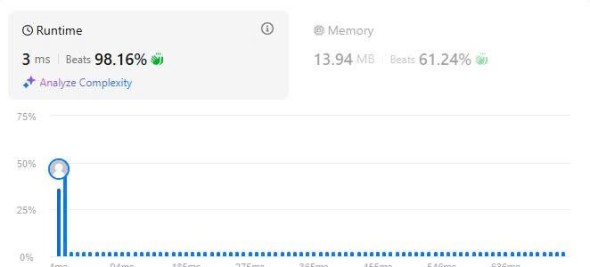

# 15. 3Sum
## Đề bài
Cho trước một dãy số nguyên nums có độ dài n và một số nguyên mục tiêu target, hãy tìm ra 3 số trong dãy số nums có tổng đạt giá trị gần với target nhất.

Trả về giá trị của tổng ba số đó.

Hãy lưu ý rằng mỗi đầu vào chỉ có thể có chính xác 1 kết quả đúng.

**Ví dụ 1:**
Đầu vào: nums = [-1,2,1,-4], target = 1
Đầu ra: 2
Giải thích: Tổng khả dĩ có giá trị gần với targer nhất là 2. (-1 + 2 + 1 = 2).

**Ví dụ 2:**
Input: nums = [0,0,0], target = 1
Output: 0
Explanation: Tổng khả dĩ có giá trị gần với targer nhất là 0. (0 + 0 + 0 = 0).

**Giới hạn:**
- 3 <= nums.length <= 3000
- -1000 <= nums[i] <= 1000
- -10^4 <= targer <= 10^4

## Giải thích ý tưởng thuật toán

Đây là bài toán biến thể của bài 3Sum với mục tiêu sum = 0 thì bài này sum = targer nên ta có thể tái cấu trúc ý tưởng của bài 3Sum để lọc các bộ 3 khả dĩ rồi sau đó so sánh khoảng cách giữa tổng các bộ ba để tìm kết quả sát với target nhất.

Bước 1: Sắp xếp mảng đã cho theo thứ tự tăng dần.

Bước 2: Khai báo biến rs (dùng để trả kết quả), T (Tính tổng 3 số), n (độ dài dãy số nums), l(Đầu mút trái), r (Đầu mút phải).

Bước 3: Gán rs = tổng 3 số hạn đầu dãy. (Dùng làm mốc so sánh đầu tiên).

Bước 4: Tạo vòng lặp for i di chuyển từ 0 đến độ dài dãy số - 2 (Lưu ý vấn đề độ dài của dãy nếu bạn không - 2 đơn vị thì sẽ bị lỗi vượt giới hạn chỉ số)

**Trong vòng lặp for**

Bước 5: Tạo đầu mút bên trái (l) với vị trí lớn hơn i 1 đơn vị.

Bước 6: Tạo đầu mút bên phải (r) với vị trí = độ dài mảng - 1 (Bởi máy tính bắt đầu đếm từ 0 nhưng con người lại bắt đầu đếm từ 1 và kết quả của hàm vector.size() luôn trả kết quả theo cách đếm của con người do đó bạn phải từ 1 đơn vị để lấy đúng độ dài của dãy)

Bước 7: Tạo điều kiện loại bỏ số trùng lặp tại vị trí i với i >= 1 và nums[i] == nums[i - 1] continue (Ta luôn phải lấy số đầu tiên và di chuyển i nên phải so sánh i hiện tại với i ở vị trí trước đó nếu cả 2 bằng nhau thì bỏ qua).

Bước 8: Tạo vòng lặp while với điều kiện l < r (l di chuyển từ trái sang phải luôn có thứ tự tăng dần, r di chuyển từ phải qua trái luôn có thứ tự giảm dần cho nên thời điểm giao nhau của l và r là khi cả 2 bằng nhau nếu dãy số chẵn và l > r nếu dãy số lẻ).

**Trong vòng lặp while**

Bước 9: Gán T = nums[i] + nums[l] + nums[r].

Bước 10: Xét điều kiện T - target = 0 thì rs = T và ngắt vòng lặp (Đây là điều kiện xác định đã tìm được target)

Bước 11: Xét điều kiện |T - target| < |rs - target| nếu đúng thì rs = T. (Đây là điều kiện xác định khoảng cách giữa T và rs cái nào gần với target hơn nếu T gần hơn thì gán rs = T).

Bước 12: Xét điều kiện T - target < 0 nếu đúng là tăng l. (Đây là điều kiện dùng để di chuyển đầu mút l vì dãy số sắp xếp tăng dần mà tổng 3 số lại < target nghĩa là cần tăng giá trị nên phải di chuyển l)

Bước 13: Tất cả các điều kiện còn lại đều giảm r.

Bước 14: Sau khi thoát vòng lặp while lúc này đã thay đổi rs thì lại xét điều kiện ngắt sớm là rs - target == 0 (Điều kiện này dùng để xác định rs đã mang giá trị cần tìm hay chưa nếu đúng thì ngắt vòng lặp để tiết kiệm thời gian).

Bước 15: return rs.

## Kết quả LeetCode

## Thảo luận

Thuật toán này có độ phức tạp O(n^2) như 3Sum nhanh hơn các sử dụng 3 vòng lặp nhưng vẫn đảm bảo được kết quả cuối cùng.

## Tham khảo

**Source code C++:** [3Sum-Closest.cpp](./3Sum-Closest.cpp)

**Source code C++ 3Sum:** [3Sum.cpp](../15.%203Sum/3Sum.cpp)

**Giải thích thuật toán 3Sum:** [Giải thích thuật toán 3Sum](../15.%203Sum/3Sum-algorithms.md)

-Chúc các bạn thành công-
