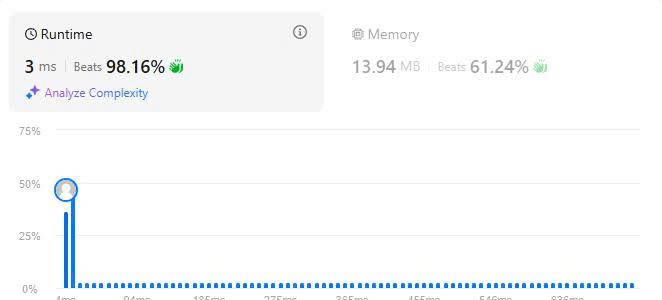

# 16. 3Sum Closest
## Đề bài
Cho trước một dãy số nguyên nums có độ dài n và một số nguyên mục tiêu target, hãy tìm ra 3 số trong dãy số nums có tổng đạt giá trị gần với target nhất.

Trả về giá trị của tổng ba số đó.

Hãy lưu ý rằng mỗi đầu vào chỉ có thể có chính xác 1 kết quả đúng.

**Ví dụ 1:**
Đầu vào: nums = [-1,2,1,-4], target = 1
Đầu ra: 2
Giải thích: Tổng khả dĩ có giá trị gần với targer nhất là 2. (-1 + 2 + 1 = 2).

**Ví dụ 2:**
Input: nums = [0,0,0], target = 1
Output: 0
Explanation: Tổng khả dĩ có giá trị gần với targer nhất là 0. (0 + 0 + 0 = 0).

**Giới hạn:**
- 3 <= nums.length <= 3000
- -1000 <= nums[i] <= 1000
- -10^4 <= targer <= 10^4

## Phân tích dữ liệu

Bài toán 3Sum Closest có dữ liệu đầu vào và ràng buộc giống như 3Sum dẫn đến ta có thể sắp xếp mảng trở nên tuyến tính rồi dùng công thức.

a + b + c = target (1)

=> b + c = target - a (2)

Gọi need = b + c (3)

(2)(3) => need = target - a (4)

Nếu need > target ta phải giảm c và ngược lại, bởi đây là dãy số tăng tuyến tính b luôn < c dựa trên phương trình (4) ta phải giảm c để hạ giá trị của need để need nằm gần target nhất có thể.

Tuy nhiên, bài này lại không thể dừng sớm như bài 3Sum với a > target bởi vì target của bài 3Sum = 0.

Với a > 0 thì mọi số a + b + c đều > 0, nhưng bài này target lại là 1 số bất kỳ. Dựa trên phương trình (3)(4).

b + c = target - a (3)

need = b + c (4)

(3)(4) Nếu a > target dẫn đến vế bên phải luôn âm do 1 số nhỏ hơn trừ số lớn hơn. Lúc này, ta phải điều chỉnh need để need có khoảng cách gần target nhất có thể.

Nếu need > target thì giảm c và ngược lại.

## Giải thích ý tưởng thuật toán

Đây là bài toán biến thể của bài 3Sum với mục tiêu sum = 0 thì bài này sum = targer nên ta có thể tái cấu trúc ý tưởng của bài 3Sum để lọc các bộ 3 khả dĩ rồi sau đó so sánh khoảng cách giữa tổng các bộ ba để tìm kết quả sát với target nhất.

Bước 1: Sắp xếp mảng đã cho theo thứ tự tăng dần.

Bước 2: Khai báo biến rs (dùng để trả kết quả), T (Tính tổng 3 số), n (độ dài dãy số nums), l(Đầu mút trái), r (Đầu mút phải).

Bước 3: Gán rs = tổng 3 số hạn đầu dãy. (Dùng làm mốc so sánh đầu tiên).

Bước 4: Tạo vòng lặp for i di chuyển từ 0 đến độ dài dãy số - 2 (Lưu ý vấn đề độ dài của dãy nếu bạn không - 2 đơn vị thì sẽ bị lỗi vượt giới hạn chỉ số)

**Trong vòng lặp for**

Bước 5: Tạo đầu mút bên trái (l) với vị trí lớn hơn i 1 đơn vị.

Bước 6: Tạo đầu mút bên phải (r) với vị trí = độ dài mảng - 1 (Bởi máy tính bắt đầu đếm từ 0 nhưng con người lại bắt đầu đếm từ 1 và kết quả của hàm vector.size() luôn trả kết quả theo cách đếm của con người do đó bạn phải từ 1 đơn vị để lấy đúng độ dài của dãy)

Bước 7: Tạo điều kiện loại bỏ số trùng lặp tại vị trí i với i >= 1 và nums[i] == nums[i - 1] continue (Ta luôn phải lấy số đầu tiên và di chuyển i nên phải so sánh i hiện tại với i ở vị trí trước đó nếu cả 2 bằng nhau thì bỏ qua).

Bước 8: Tạo vòng lặp while với điều kiện l < r (l di chuyển từ trái sang phải luôn có thứ tự tăng dần, r di chuyển từ phải qua trái luôn có thứ tự giảm dần cho nên thời điểm giao nhau của l và r là khi cả 2 bằng nhau nếu dãy số chẵn và l > r nếu dãy số lẻ).

**Trong vòng lặp while**

Bước 9: Gán T = nums[i] + nums[l] + nums[r].

Bước 10: Xét điều kiện T - target = 0 thì rs = T và ngắt vòng lặp (Đây là điều kiện xác định đã tìm được target)

Bước 11: Xét điều kiện |T - target| < |rs - target| nếu đúng thì rs = T. (Đây là điều kiện xác định khoảng cách giữa T và rs cái nào gần với target hơn nếu T gần hơn thì gán rs = T).

Bước 12: Xét điều kiện T - target < 0 nếu đúng là tăng l. (Đây là điều kiện dùng để di chuyển đầu mút l vì dãy số sắp xếp tăng dần mà tổng 3 số lại < target nghĩa là cần tăng giá trị nên phải di chuyển l)

Bước 13: Tất cả các điều kiện còn lại đều giảm r.

Bước 14: Sau khi thoát vòng lặp while lúc này đã thay đổi rs thì lại xét điều kiện ngắt sớm là rs - target == 0 (Điều kiện này dùng để xác định rs đã mang giá trị cần tìm hay chưa nếu đúng thì ngắt vòng lặp để tiết kiệm thời gian).

Bước 15: return rs.

## Kết quả LeetCode

## Thảo luận

Thuật toán này có độ phức tạp O(n^2) như 3Sum nhanh hơn các sử dụng 3 vòng lặp nhưng vẫn đảm bảo được kết quả cuối cùng.

## Tham khảo

**Source code C++:** [3Sum-Closest.cpp](./3Sum-Closest.cpp)

**Source code C++ 3Sum:** [3Sum.cpp](../15.%203Sum/3Sum.cpp)

**Giải thích thuật toán 3Sum:** [Giải thích thuật toán 3Sum](../15.%203Sum/Readme.md)

-Chúc các bạn thành công-

